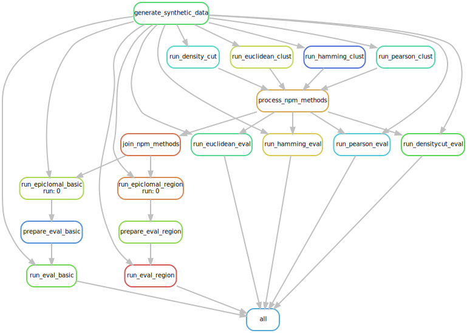
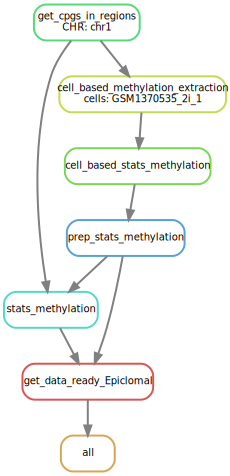

# Epiclomal
Epiclomal package, software for clustering of sparse DNA methylation data

This folder contains the following:

- epiclomal is the software for clustering in Python 3.0
- examples contains some simple examples of how to generate synthetic data, run the non-probabilistic methods, run Epiclomal and evaluate and plot the results. These examples are just bash scripts and do not use the kronos pipeline.
- kronos_scripts contains pipelines and components for running kronos pipelines. You need kronos pipeliner 2.3 to run this, see https://pypi.org/project/kronos-pipeliner/.
- process_real_data contains R scripts to pre-process DNA methylation data given a set of functional regions.
- scripts contains R scripts to generate synthetic data, run non-probabilistic methods and generate plots. Some of the requirements for scripts are: MCMCpack, densityCut (https://bitbucket.org/jerry00/densitycut_dev) and its requirements, NbClust, pcaMethods, pheatmap, argparse.

If you use this software, please cite "Epiclomal: probabilistic clustering of sparse single-cell DNA methylation data,
Camila P. E. de Souza, Mirela Andronescu, Tehmina Masud, Farhia Kabeer, Justina Biele, Emma Laks, Daniel Lai, Jazmine Brimhall, Beixi Wang, Edmund Su, Tony Hui, Qi Cao, Marcus Wong, Michelle Moksa, Richard A. Moore, Martin Hirst, Samuel Aparicio, Sohrab P. Shah, doi: https://doi.org/10.1101/414482"


## Setup and Installation

Set up conda with the required packages.

First ensure you have the correct channels:
```
conda config --add channels 'https://conda.anaconda.org/dranew'
conda config --add channels 'https://conda.anaconda.org/aroth85'
conda config --add channels 'https://conda.anaconda.org/shahcompbio'
conda config --add channels 'bioconda'
conda config --add channels 'r'
conda config --add channels 'conda-forge'
```

### From Source

Clone Epiclomal:

```
git clone https://github.com/shahcompbio/Epiclomal.git
cd Epiclomal
```

Then create an environment with the required packages:

```
conda create --name Epiclomal --file conda_packages.txt
```

Activate the environment:

```
conda activate Epiclomal
```

Add Epiclomal Python package into the current site packages:
```
python setup.py install
```

Epiclomal R package has dependency on DensityCut, which must be manually installed before adding Epiclomal R package. Install according to instructions listed here: https://bitbucket.org/jerry00/densitycut_dev/

Add Epiclomal R package into current site packages:
```
R CMD build REpiclomal
R CMD INSTALL REpiclomal_1.0.tar.gz
```

## Usage

### Run entire pipeline with generated synthetic data

A Snakemake workflow exists to generate synthetic data and run the clustering and cluster evaluation software against the generated data.

This workflow follows this diagram, but with 300 iterations for run_epiclomal_basic and run_epiclomal_region



To run the Snakemake workflow, first edit the config file found at Epiclomal/snakemake/synthetic_data/config.yaml with appropriate paths and parameters. Then run
```
snakemake -s /path/to/Epiclomal/snakemake/synthetic_data/Snakefile --configfile /path/to/Epiclomal/snakemake/synthetic_data/config.yaml
```
to run the workflow locally. To submit the jobs on the shahlab cluster and with parallelization, run
```
snakemake -s /path/to/Epiclomal/snakemake/synthetic_data/Snakefile --cluster 'qsub -V -hard -q shahlab.q -l h_vmem={resources.h_vmem}G -P shahlab_high -S /bin/bash -o {params.qsub_out} -e {params.qsub_err}' -j 32 --configfile /path/to/Epiclomal/snakemake/synthetic_data/config.yaml
```

To run each step of the synthetic data workflow individually, follow the steps outlined here: https://github.com/shahcompbio/Epiclomal/blob/master/examples/README.md

### Run pipeline with real data

The real data pipeline requires two steps which are separated into two workflows.
First, the real data must be preprocessed into a methylation and region file to be consumed by the clustering software.



To run the preprocessing workflow, first edit the config file found at Epiclomal/snakemake/process_real_data/config.yaml with appropriate paths and parameters. Ensure all cells to cluster are accounted for. Then run

```
snakemake -s /path/to/Epiclomal/snakemake/process_real_data/Snakefile --cluster 'qsub -V -hard -q shahlab.q -l h_vmem={resources.h_vmem}G -P shahlab_high -S /bin/bash -o {params.qsub_out} -e {params.qsub_err}' -j 32 --configfile /path/to/Epiclomal/snakemake/process_real_data/config.yaml
```

Then, to run the real data through the clustering software, edit the config file found at Epiclomal/snakemake/real_data/config.yaml with the paths to the newly generated methylation and region files. Include a true clusters file if available.
The real data workflow does 1000 iterations of Epiclomal by default, to change this, edit line 13 of the Snakefile.


```
snakemake -s /path/to/Epiclomal/snakemake/real_data/Snakefile --cluster 'qsub -V -hard -q shahlab.q -l h_vmem=32G -P shahlab_high -S /bin/bash' -j 32 --configfile /path/to/Epiclomal/snakemake/real_data/config.yaml
```

Depending on the size of the data (number of cells and number of loci), more memory may be needed for each job, to do so, change the snakemake command to have `h_vmem={memory_required}`

### Using individual components
### Epiclomal R package
In R, run `library(REpiclomal)` to use Epiclomal R Package and `?REpiclomal` in R for documentation.

### Epiclomal Python package
The Epiclomal Python package includes two scripts. One is the Epiclomal clustering algorithm and can be run using:
```
epiclomal {Basic-GeMM,Basic-BayesPy,Region-GeMM} --K {K} --config_file {config_file} --methylation_file {methylation_file} --copynumber_file {copynumber_file} --regions_file {regions_file} --initial_clusters_file {initial_clusters_file} --true_clusters_file {true_clusters_file} --true_prevalences {true_prevalences} --repeat_id {repeat_id} --bulk_file {bulk_file} --slsbulk_file {slsbulk_file} --slsbulk_iterations {slsbulk_iterations} --out_dir {out_dir} --mu_has_k {mu_has_k} --convergence_tolerance {convergence_tolerance} --max_num_iters {max_num_iters} --seed {seed} --labels_file {labels_file} --Bishop_model_selection {Bishop_model_selection} --check_uncertainty {check_uncertainty}
```

The other script is an clustering evaluation script that can be run using:
```
evaluate_clustering --true_clusters_file {true_clusters_file} --true_prevalences {true_prevalences} --predicted_clusters_file {predicted_clusters_file} --clusters_are_probabilities {clusters_are_probabilities} --results_file {results_file}
```

## Input
The base inputs for epiclomal are a list of cells of interest and their bismark bisulfite read files, a file containing regions of interest, and if available, a true cluster file.

## Output
The final outputs of the epiclomal pipeline are a file containing the best clustering from epiclomal, which can be found through `all_results_bestrun_{basic|region}.tsv` which is created by the final evaluation script, and final methylation plots of the clustering.

## Source code structure
### epiclomal
Contains the Epiclomal python package. Package includes software to run Epiclomal clustering as well as clustering evaluation script.

### process_real_data
Contains R scripts to process real data to be ingestable by REpiclomal in R and Epiclomal in Python.

### REpiclomal
Contains REpiclomal R package. Contains non-probabilistic clustering method calling functions, visualization functions, and epiclomal evaluation functions.

### scripts
Contains R scripts that are called by various parts of the epiclomal workflow. Scripts mainly call functions found in REpiclomal R package.

### snakemake
Contains Snakefiles and config files that run Epiclomal workflow for real and synthetic data.


